# NUST Lifeline: Automated Hostel Funds Management System

<div align="center">

[](https://script.google.com/)
[](https://ai.google.dev/)
[]()
[]()

**A zero-cost financial workflow automation system for student financial aid management built on Google Apps Script.**

[Quick Start](#-quick-start) • [Documentation](#-documentation) • [Architecture](#-architecture) • [Contributing](#-contributing)

</div>

---

## 📋 Table of Contents

- [Overview](#-overview)
- [Key Features](#-key-features)
- [Quick Start](#-quick-start)
- [Architecture](#-architecture)
- [Documentation](#-documentation)
- [Project Structure](#-project-structure)
- [Configuration](#-configuration)
- [Deployment](#-deployment)
- [Troubleshooting](#-troubleshooting)
- [Version History](#-version-history)

---

## 🎯 Overview

The **NUST Lifeline System** is a financial workflow automation platform designed to manage the complete lifecycle of student financial aid—from donor pledges to verified hostel fund disbursements.

### The Problem We Solve

Managing student financial aid manually involves:
- **Fragmented processes** across emails, spreadsheets, and paper records
- **Race conditions** when multiple volunteers allocate the same funds
- **Privacy risks** exposing sensitive student data to unauthorized personnel
- **Audit gaps** making forensic tracking impossible
- **Human latency** delaying fund allocation by days

### Our Solution

A **serverless ERP** built entirely on Google Workspace that provides:

| Capability | Implementation |
|-----------|----------------|
| **Transactional Integrity** | Optimistic concurrency control via `LockService` |
| **Privacy by Design** | Air-gapped two-workbook architecture |
| **AI-Powered Verification** | Gemini 3 multimodal receipt analysis |
| **Forensic Auditability** | Immutable event logging with RFC-822 message threading |
| **Human-in-the-Loop** | Sidebar UI for controlled financial decisions |

---

## ✨ Key Features

### 🔐 Security & Privacy
- **Air-Gapped Architecture**: Student identities are physically separated from operations data
- **Role-Based Access Control**: Implemented via Google Drive permissions
- **Sanitized Proxy Pattern**: Volunteers access only non-sensitive data via server-side filtering

### 💰 Financial Controls
- **Real-Time Balance Calculation**: Prevents over-allocation through live ledger computation
- **Optimistic Concurrency Control**: Read-lock-validate-write pattern prevents double-spending
- **Multi-Receipt Support**: Handles partial payments and multiple proof submissions

### 🤖 AI Integration
- **Multimodal Receipt Analysis**: Visual extraction of transfer dates and amounts from banking slips
- **Semantic Email Classification**: Understands verification replies regardless of phrasing
- **Intelligent Watchdog**: Autonomous verification loop with human escalation

### 📊 Reporting & Analytics
- **Star Schema Data Warehouse**: Anonymized reporting with financial reconciliation
- **Full Lifecycle Tracking**: Pledge → Receipt → Allocation → Verification → Closure

---

## 🚀 Quick Start

### Prerequisites

- Google Workspace account (personal or organizational)
- [clasp](https://github.com/google/clasp) CLI installed (`npm install -g @google/clasp`)
- Gemini API key from [Google AI Studio](https://aistudio.google.com/)

### Installation

```bash
# 1. Clone this repository
git clone https://github.com/your-org/hostel_funds_management.git
cd hostel_funds_management

# 2. Login to clasp
clasp login

# 3. Create or clone the Apps Script project
clasp create --type sheets --title "NUST Lifeline System"
# OR
clasp clone <your-script-id>

# 4. Push the code
clasp push

# 5. Open in browser
clasp open
```

### Initial Configuration

1. **Update `Config.js`** with your specific Sheet and Folder IDs
2. **Set Script Properties** (Extensions → Apps Script → Project Settings → Script Properties):
   - `GEMINI_API_KEY`: Your Gemini API key
3. **Create Gmail Labels**:
   - `Receipts/To-Process`
   - `Receipts/Processed`
   - `Watchdog/Processed`
   - `Watchdog/Manual-Review`
4. **Set up Triggers** (Extensions → Apps Script → Triggers):
   - `onFormSubmitTrigger` → From spreadsheet → On form submit
   - `processIncomingReceipts` → Time-driven → Every 10 minutes
   - `runWatchdog` → Time-driven → Every 15 minutes
   - `onAuditSheetEdit` → From spreadsheet → On edit

---

## 🏗️ Architecture

### System Context (C4 Level 1)

```mermaid
graph TD
    subgraph External
        Donor[👤 Donor/Alumni]
        Hostel[🏢 University Hostel Admin]
    end
    
    subgraph "NUST Lifeline System"
        Forms[📝 Google Forms]
        Sheets[(📊 Google Sheets)]
        Script[⚙️ Apps Script Engine]
        AI[🤖 Gemini 3 AI]
        Sidebar[🖥️ Sidebar UI]
    end
    
    subgraph "Google Services"
        Gmail[📧 Gmail]
        Drive[📁 Drive]
    end
    
    Donor -->|1. Submit Pledge| Forms
    Forms -->|Trigger| Script
    Script -->|Store Data| Sheets
    Script -->|Send Confirmation| Gmail
    Gmail -->|Email| Donor
    
    Donor -->|2. Send Receipt| Gmail
    Script -->|Process & Analyze| AI
    Script -->|Store Proof| Drive
    
    Sidebar -->|3. Allocate Funds| Script
    Script -->|Verify with AI| AI
    Script -->|Notify| Gmail
    Gmail -->|Request Verification| Hostel
    
    Hostel -->|4. Confirm Receipt| Gmail
    Script -->|Close Loop| Sheets
    Script -->|Notify Donor| Gmail
```



### Data Flow

```
┌─────────────────────────────────────────────────────────────────────────────┐
│                           DONATION LIFECYCLE                                 │
├──────────────┬──────────────┬──────────────┬──────────────┬────────────────┤
│   PLEDGE     │   RECEIPT    │  ALLOCATION  │ VERIFICATION │    CLOSURE     │
├──────────────┼──────────────┼──────────────┼──────────────┼────────────────┤
│ Form Submit  │ Email Parse  │ Sidebar UI   │ AI Watchdog  │ Auto-Close     │
│      ↓       │      ↓       │      ↓       │      ↓       │      ↓         │
│ Generate ID  │ AI Extract   │ Lock Balance │ Match Reply  │ Notify Donor   │
│      ↓       │      ↓       │      ↓       │      ↓       │      ↓         │
│ Send Email   │ Store Proof  │ Email Hostel │ Update Log   │ Update Status  │
│      ↓       │      ↓       │      ↓       │      ↓       │      ↓         │
│ Log Audit    │ Update Totals│ Log Alloc    │ Log Verify   │ Log Close      │
└──────────────┴──────────────┴──────────────┴──────────────┴────────────────┘
```

### Security Model

| Layer | Control | Implementation |
|-------|---------|----------------|
| **Data Segregation** | Physical Separation | Two spreadsheets: CONFIDENTIAL (student identities) and OPERATIONS (transactional) |
| **Access Control** | RBAC | Google Drive folder/file permissions |
| **Data Proxy** | Sanitized Access | `studentServices.js` returns only operational fields to volunteers |
| **Concurrency** | Locking | `LockService.getScriptLock()` with 30s timeout |
| **Audit Trail** | Immutable Log | Append-only `Audit Trail` sheet with actor/timestamp/metadata |

---

## 📚 Documentation

### For Different Audiences

| Document | Description | Audience |
|----------|-------------|----------|
| **[📘 USER_GUIDE.md](docs/USER_GUIDE.md)** | Day-to-day operations guide | Volunteers, Admin Staff |
| **[🏗️ ARCHITECTURE.md](docs/ARCHITECTURE.md)** | System design and security model | Technical Leads, Security Officers |
| **[🧠 ADR.md](docs/ADR.md)** | Architectural Decision Records | Architects, Case Study Authors |
| **[🤖 AI_WATCHDOG.md](docs/AI_WATCHDOG.md)** | AI verification engine details | AI Engineers, Data Scientists |
| **[⚙️ TECHNICAL_DEEP_DIVE.md](docs/TECHNICAL_DEEP_DIVE.md)** | Codebase structure and algorithms | Developers, Maintainers |
| **[🔧 MAINTENANCE_RECOVERY.md](docs/MAINTENANCE_RECOVERY.md)** | Operations and recovery procedures | DevOps, SREs |
| **[🚀 MIGRATION_GUIDE.md](docs/MIGRATION_GUIDE.md)** | Production migration runbook | System Administrators |
| **[📖 API_REFERENCE.md](docs/API_REFERENCE.md)** | Complete function reference | Developers |
| **[🔄 DATA_MODEL.md](docs/DATA_MODEL.md)** | Schema and status definitions | Developers, Data Analysts |

---

## 📁 Project Structure

```
hostel_funds_management/
│
├── 📄 Config.js              # Central configuration (IDs, mappings, templates)
├── 📄 StatusConfig.js        # FSM status definitions and transitions
├── 📄 StateManager.js        # Status transition validation utility
│
├── 🔄 WORKFLOWS
│   ├── DonorWorkflow.js      # New pledge processing and confirmation
│   ├── AdminWorkflow.js      # Receipt processing, allocations, batch operations
│   └── Watchdog.js           # Autonomous verification monitoring
│
├── 🛠️ SERVICES
│   ├── CoreLogic.js          # Business logic (balance calc, status updates)
│   ├── SidebarService.js     # Client-server bridge for HTML UI
│   ├── LLM_Service.js        # Gemini AI integration
│   ├── AuditService.js       # Immutable event logging
│   ├── ReportingService.js   # ETL for analytics warehouse
│   ├── MigrationService.js   # Data backfill and migration tools
│   └── studentServices.js    # Student/pledge data synchronization
│
├── 🔧 UTILITIES
│   ├── Utilities.js          # Email templates, parsing, helpers
│   └── Triggers.js           # Event handlers and menu setup
│
├── 🖥️ UI
│   └── Sidebar.html          # HTML/JS sidebar for fund allocation
│
├── ⚙️ CONFIGS
│   ├── configs/Config.dev.js  # Development configuration
│   └── configs/Config.prod.js # Production configuration
│
├── 📚 DOCS
│   └── docs/                  # Documentation suite
│
├── 📋 METADATA
│   ├── .clasp.json           # Apps Script project binding
│   ├── appsscript.json       # Manifest (scopes, runtime)
│   └── change_history.md     # Detailed changelog
│
└── 📖 README.md              # This file
```

---

## ⚙️ Configuration

### Environment Setup

The system uses `Config.js` as the single source of configuration. For multiple environments:

```javascript
// Use configs/Config.dev.js or configs/Config.prod.js
// Copy the appropriate file to Config.js before deploying
```

### Key Configuration Sections

| Section | Purpose |
|---------|---------|
| `CONFIG` | Spreadsheet IDs, folder IDs, AI model, pledge amounts |
| `SHEETS` | Sheet names and column mappings |
| `EMAILS` | System email addresses (hostel, UAO, process owner) |
| `MAPPINGS` | Chapter-to-lead email mappings |
| `TEMPLATES` | Google Doc template IDs for emails |
| `FORM_KEYS` | Google Form question titles for parsing |

### Script Properties

Set these in Apps Script Project Settings:

| Property | Description | Required |
|----------|-------------|----------|
| `GEMINI_API_KEY` | API key for Gemini AI | ✅ Yes |
| `REPORTING_SS_ID` | ID of reporting sandbox (auto-created) | Auto |
| `REPORTING_SALT` | Cryptographic salt for anonymization | Auto |

---

## 🚢 Deployment

### Development Workflow

```bash
# Make changes locally
# Push to Apps Script
clasp push

# View logs
clasp logs
```

### Production Deployment

See **[MIGRATION_GUIDE.md](docs/MIGRATION_GUIDE.md)** for the complete production migration runbook.

Key steps:
1. Clone assets to production Google account
2. Update Config.js with production IDs
3. Set up triggers
4. Configure script properties
5. Validate with test transactions

---

## 🔍 Troubleshooting

### Common Issues

| Issue | Cause | Solution |
|-------|-------|----------|
| "System is busy" error | Lock contention | Wait 30s and retry |
| Sidebar won't load | Row selection invalid | Select a data row (not header) |
| AI returns null | Missing API key | Check `GEMINI_API_KEY` in Script Properties |
| Emails not sending | Quota exceeded | Check daily limits, upgrade to Workspace |
| Receipt not processed | Wrong Gmail label | Verify `Receipts/To-Process` label exists |

### Debug Tools

```javascript
// Run in Apps Script editor
function debugPledgeBalance() {
  const pledgeId = 'PLEDGE-2025-1';
  const ws = SpreadsheetApp.openById(CONFIG.ssId_operations)
             .getSheetByName(SHEETS.donations.name);
  const row = findRowByValue(ws, SHEETS.donations.cols.pledgeId, pledgeId);
  Logger.log(getRealTimePledgeBalance(pledgeId, row.data));
}

// Test AI connection
function testGeminiConnection() {
  test_analyzeEmail();
}
```

### Emergency Procedures

**Kill Switch (Stop Automation):**
1. Go to Extensions → Apps Script → Triggers
2. Delete `runWatchdog` and `processIncomingReceipts` triggers
3. System reverts to manual mode

See **[MAINTENANCE_RECOVERY.md](docs/MAINTENANCE_RECOVERY.md)** for complete recovery procedures.

---

## 📈 Version History

**Current Version: 56**

### Recent Changes

| Version | Date | Highlights |
|---------|------|------------|
| 56 | 2025-12-19 | Multimodal receipt analysis, transfer date extraction |
| 55 | 2025-12-19 | Mermaid diagrams, documentation upgrade |
| 54 | 2025-12-19 | Migration guide, expanded ADRs |
| 53 | 2025-12-18 | Documentation refinement, professional tone |
| 52 | 2025-12-18 | Whitepaper structure, cross-processing protection |

See **[change_history.md](change_history.md)** for the complete changelog.

---

## 🤝 Contributing

### Development Guidelines

1. **Code Style**: Follow existing patterns, use JSDoc comments
2. **Testing**: Use `test_*` functions for manual verification
3. **Logging**: Use `writeLog()` for system logs, `logAuditEvent()` for business events
4. **Configuration**: Never hardcode IDs or emails—use `Config.js`

### Pull Request Process

1. Create a feature branch
2. Test thoroughly in development environment
3. Update documentation and changelog
4. Submit PR with description of changes

---

## 📄 License

This project is proprietary software developed for NUST Lifeline Campaign. All rights reserved.

---

<div align="center">

**Built with ❤️ for NUST Students**

[Report Bug](mailto:nustlifelinecampaign@gmail.com) • [Request Feature](mailto:nustlifelinecampaign@gmail.com)

</div>
