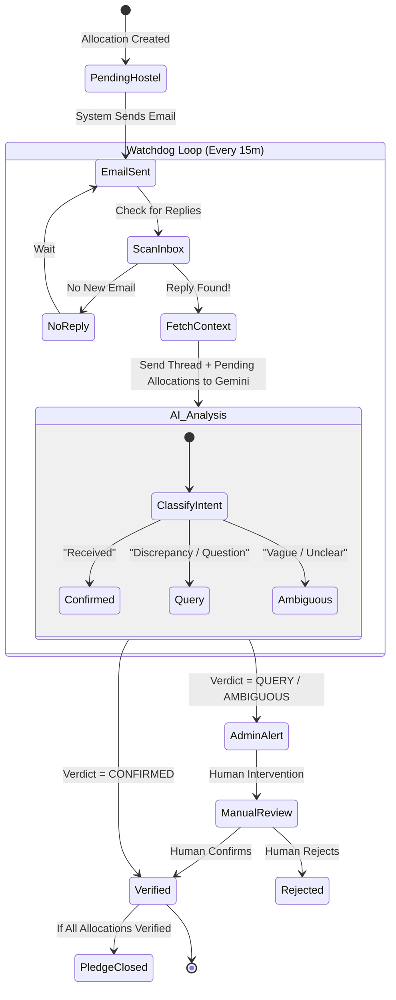

# 🤖 The AI Watchdog: Agentic Verification Engine

> **Scope:** Logic, Prompt Engineering, and Safety Protocols for the AI Agent.

The **Watchdog** is an autonomous agent designed to close the feedback loop between the system and external stakeholders (University Administration).

## 1. The Watchdog Process Flow

This state diagram illustrates the lifecycle of a verification request, showing how the AI decides between `Verified`, `Query`, and `Ambiguous` states.

---

## 2. The Verification Logic

The agent does not blindly accept text. It performs a **Three-Way Match**:
1.  **The Pending Ledger:** What did we say we sent? (e.g., "50k for Student A, 20k for Student B").
2.  **The University Reply:** What did they say they received? (e.g., "Received for A. Student B is unknown.").
3.  **The Context:** The full email thread history.

### The Analysis Pipeline
1.  **Fetch:** Retrieve `PENDING_HOSTEL` allocations from the database.
2.  **Contextualize:** Reconstruct the email thread using `getThreadContext()` to provide the AI with the full conversation history.
3.  **Inference:** `Gemini 3` evaluates the reply against the pending items.
4.  **Action:** The Agent returns a structured verdict (`CONFIRMED`, `PARTIAL`, `QUERY`, `AMBIGUOUS`).

---

## 3. Prompt Engineering Strategy

We utilize a **Role-Based Prompting** strategy with strict output constraints to ensure determinism.

**Persona:**
> "You are an automated accounting assistant. Your job is to strictly verify financial transactions based on email evidence."

**Constraints:**
*   **Strict JSON Output:** The model must return valid JSON.
*   **Ambiguity Bias:** "If you are not 100% sure, result must be AMBIGUOUS."

---

## 4. Failure Modes & Safety Rails

### A. The "I Don't Know" Fallback
If the language used by the university is vague (e.g., "Noted", "We will check"), the AI is trained to classify this as **AMBIGUOUS**.
*   **System Action:** The thread is flagged with a Gmail Label `Watchdog/Manual-Review`.
*   **Alert:** An email is sent to the Admin: "AI requires human judgment."
*   **Result:** The automation fails safe; it does not close the transaction erroneously.

### B. Cross-Processing Protection
To prevent the AI from analyzing unrelated emails, the Watchdog ingests **only** threads that:
1.  Match the strict Subject Regex (`Ref: PLEDGE-`).
2.  Are from a whitelist of domain senders.
3.  Are NOT already labelled as `Processed`.
