# 🤖 The AI Watchdog: Agentic Verification Engine

> **Scope:** Deep dive into AI logic, prompt engineering, safety protocols, and the autonomous verification system.

The **Watchdog** is an autonomous agent designed to close the feedback loop between the system and external stakeholders (University Administration), using AI to analyze, classify, and act on hostel replies.

---

## Table of Contents

- [Overview](#overview)
- [Architecture](#architecture)
- [Process Flow](#process-flow)
- [AI Capabilities](#ai-capabilities)
- [Prompt Engineering](#prompt-engineering)
- [Safety & Failure Modes](#safety--failure-modes)
- [Performance Tuning](#performance-tuning)
- [Testing & Validation](#testing--validation)

---

## Overview

### The Problem

When the system sends a verification request to the hostel, the reply can take many forms:
- "Confirmed, funds received for student 123456"
- "Yes, done"
- "Received your email. Forwarded to accounts."
- "The student name doesn't match our records"
- "Please clarify the reference number"

Traditional regex-based parsing cannot handle this variability. We need **semantic understanding**.

### The Solution

Deploy Google **Gemini 3 Flash** as a reasoning engine that:
1. Understands the *intent* of replies, not just keywords
2. Matches replies to specific pending allocations
3. Knows when to escalate to humans

### Design Goals

| Goal | Description |
|------|-------------|
| **Maximize auto-verification** | Reduce manual review burden by handling clear confirmations |
| **Minimize false positives** | Never mark unverified allocations as verified |
| **Fail safe** | When uncertain, escalate to humans rather than guess |
| **Fast response** | Process within the 15-minute trigger cycle |

> **Note:** The system does not currently track these metrics. Accuracy depends on Gemini AI performance and email clarity.

---

## Architecture

### Component Diagram

```mermaid
graph TD
    subgraph "Watchdog Engine"
        Trigger[⏰ Time Trigger<br/>Every 15 min]
        Scanner[📧 Inbox Scanner]
        Parser[📝 Context Parser]
        AI[🤖 Gemini Analyzer]
        Executor[⚡ Action Executor]
        Notifier[📬 Notification Service]
    end
    
    subgraph "Data Sources"
        Gmail[(Gmail<br/>Inbox)]
        AllocLog[(Allocation<br/>Log)]
        AuditLog[(Audit<br/>Trail)]
    end
    
    subgraph "Destinations"
        StatusUpdate[Status Update]
        DonorEmail[Donor Email]
        AdminAlert[Admin Alert]
    end
    
    Trigger --> Scanner
    Scanner --> Gmail
    Gmail --> Parser
    Parser --> AI
    AI --> Executor
    
    AllocLog --> AI
    
    Executor --> StatusUpdate
    Executor --> DonorEmail
    Executor --> AdminAlert
    
    Executor --> AuditLog
```



### Execution Flow

```
┌─────────────────────────────────────────────────────────────────┐
│                    WATCHDOG EXECUTION                            │
├─────────────────────────────────────────────────────────────────┤
│  1. TRIGGER                                                      │
│     └─ Time-driven (every 15 minutes)                           │
│                                                                  │
│  2. SCAN                                                         │
│     └─ Gmail search: from:(hostel) subject:(Ref: PLEDGE-)       │
│     └─ Exclude: -label:Watchdog/Processed -label:Manual-Review  │
│                                                                  │
│  3. FETCH CONTEXT                                                │
│     └─ Get open allocations for the Pledge/Batch ID             │
│     └─ Build thread context (current + history)                 │
│                                                                  │
│  4. ANALYZE (AI)                                                 │
│     └─ Send to Gemini with structured prompt                    │
│     └─ Receive JSON: { status, confirmedAllocIds, reasoning }   │
│                                                                  │
│  5. EXECUTE                                                      │
│     ├─ CONFIRMED_ALL → Update all, notify donors, close loop    │
│     ├─ PARTIAL → Update matched, flag remainder                 │
│     ├─ AMBIGUOUS → Label for manual review, alert admin         │
│     └─ QUERY → Label for manual review, alert admin             │
│                                                                  │
│  6. LOG                                                          │
│     └─ Audit trail entry for every action                       │
└─────────────────────────────────────────────────────────────────┘
```

---

## Process Flow

### State Machine Diagram


---

## AI Capabilities

### 1. Semantic Email Analysis

The AI understands natural language variations:

| Email Text | AI Classification | Confidence |
|------------|-------------------|------------|
| "Confirmed, funds credited to dining account" | CONFIRMED | HIGH |
| "Received and processed" | CONFIRMED | HIGH |
| "Noted. Will check and update" | AMBIGUOUS | MEDIUM |
| "The CMS ID doesn't match our records" | QUERY | HIGH |
| "Forwarding to the concerned department" | AMBIGUOUS | MEDIUM |
| "Done. Thanks." | CONFIRMED | HIGH |

### 2. Allocation Matching

When multiple allocations exist for a pledge, the AI:
1. Extracts specific identifiers from the email (CMS IDs, names, amounts)
2. Cross-references with pending allocations
3. Returns matched allocation IDs

```javascript
// AI Input
openAllocations: [
  { allocId: 'ALLOC-001', cms: '123456', amount: 50000 },
  { allocId: 'ALLOC-002', cms: '789012', amount: 25000 }
]

// Email: "Received funds for student 123456"

// AI Output
{
  status: 'PARTIAL',
  confirmedAllocIds: ['ALLOC-001'],
  reasoning: 'Email explicitly mentions CMS 123456. No mention of 789012.'
}
```

### 3. Multimodal Receipt Analysis

When processing donor receipts, the AI:
1. **Sees** the receipt image/PDF
2. **Extracts** transfer date and amount
3. **Validates** against pledge date and expected amount
4. **Rates** confidence (HIGH/MEDIUM/LOW)

```javascript
// AI Output for Receipt Analysis
{
  category: 'RECEIPT_SUBMISSION',
  valid_receipts: [{
    filename: 'receipt.pdf',
    amount: 50000,
    date: '2025-12-15',
    confidence_score: 'HIGH',
    confidence_details: {
      amount_match: 'EXACT',
      name_match: 'LIKELY',
      destination_match: 'CONFIRMED'
    }
  }]
}
```

---

## Prompt Engineering

### Strategy: Role-Based Prompting with Constraints

We use a **Forensic Accountant** persona with strict output constraints to ensure determinism.

### Hostel Reply Prompt

```javascript
const prompt = `
  You are a Forensic Accountant. Match the email reply to pending allocations.

  Open Allocations: ${JSON.stringify(openAllocations)}
  Email Body: "${emailText}"

  Your Goal: Return a list of Allocation IDs that are POSITIVELY confirmed.
  
  Matching Rules:
  1. If email explicitly cites a Name, CMS ID, or Amount, match it.
  2. If email implies "All" (e.g. "Confirmed", "Received") without exclusions,
     match ALL pending allocations.
  3. If multiple allocations but email is vague about WHICH one, return AMBIGUOUS.
  4. If only 1 allocation and email is vague ("Confirmed"), match it.
  5. "Allocation Ref: ALLOC-xxxx" is a definitive match.
`;
```

### Output Schema Enforcement

We use Gemini's structured output to guarantee JSON format:

```javascript
generationConfig: {
  responseMimeType: "application/json",
  responseSchema: {
    type: "OBJECT",
    properties: {
      status: { 
        type: "STRING", 
        enum: ["CONFIRMED_ALL", "PARTIAL", "AMBIGUOUS", "QUERY"] 
      },
      confirmedAllocIds: { 
        type: "ARRAY", 
        items: { type: "STRING" } 
      },
      reasoning: { type: "STRING" }
    },
    required: ["status", "confirmedAllocIds", "reasoning"]
  }
}
```

### Receipt Analysis Prompt

```javascript
const prompt = `
  You are an AI Forensic Accountant for a Student Hostel Fund.
  
  === CONTEXT ===
  - PLEDGE AMOUNT: ${pledgedAmount} (Expected)
  - Pledge Date: ${strPledgeDate}
  - Email Date: ${strEmailDate}
  - Attached Files: [${attachmentNames}]
  
  === YOUR TASK ===
  1. Analyze the "CURRENT EMAIL" text to find the "DECLARED AMOUNT"
  2. VISUALLY ANALYZE the attached files to find PROOF OF PAYMENT
  3. Extract transaction details for each valid receipt
  
  === FORENSIC RULES ===
  - Transfer date must be between Pledge Date and Email Date
  - Check if destination account matches 'NUST' or 'Hostel Fund'
  - If multiple receipts show different transactions, list all
  - If duplicates, only list one
`;
```

---

## Safety & Failure Modes

### Safety Principle: Fail Safe

The AI is biased toward **caution**. When uncertain, it escalates to humans rather than making incorrect verifications.

### Failure Mode A: "I Don't Know" Fallback

If the language is vague (e.g., "Noted", "We will check"):

1. AI classifies as `AMBIGUOUS`
2. System labels thread: `Watchdog/Manual-Review`
3. System sends alert email to admin
4. Automation pauses for this transaction

```javascript
if (analysis.status === 'AMBIGUOUS' || analysis.status === 'QUERY') {
  thread.addLabel(manualLabel);
  sendAlertEmail(pledgeId, analysis, thread.getPermalink());
  logAuditEvent('SYSTEM/Watchdog', 'ALERT', pledgeId, 
    'Flagged for Manual Review', '', '', { reasoning: analysis.reasoning });
}
```

### Failure Mode B: Cross-Processing Protection

To prevent analyzing unrelated emails, the Watchdog only ingests threads that:

1. ✅ Match strict pattern: subject contains `Ref: PLEDGE-` or `Ref: BATCH-`
2. ✅ Are from whitelisted domains: `@university.edu`, DD Hostels, UAO
3. ✅ Are NOT labeled `Watchdog/Processed` or `Manual-Review`

```javascript
const query = `
  from:(${EMAILS.ddHostels} OR ${EMAILS.uao} OR "finance.university.edu") 
  subject:("Ref: PLEDGE-" OR "Ref: BATCH-") 
  -label:Watchdog/Processed 
  -label:Watchdog/Manual-Review
`;
```

### Failure Mode C: AI API Failure

If Gemini API fails or times out:

1. Function returns `null`
2. Thread is NOT labeled as processed
3. Will retry on next trigger execution
4. After repeated failures, investigate manually

```javascript
const analysis = analyzeHostelReply(threadContext, pendingAllocations);
if (!analysis) {
  writeLog('ERROR', FUNC_NAME, 'AI Analysis failed (returned null).', contextId);
  return; // Do NOT label processed, retry next time
}
```

### Failure Mode D: Malformed Response

Even with schema enforcement, edge cases exist:

```javascript
try {
  const rawText = jsonResponse.candidates[0].content.parts[0].text;
  return JSON.parse(cleanJsonOutput(rawText));
} catch (e) {
  writeLog('ERROR', FUNC_NAME, `JSON parse failed: ${e.message}`);
  return null; // Retry next cycle
}
```

---

## Performance Tuning

### Model Selection

| Model | Speed | Cost | Accuracy | Use Case |
|-------|-------|------|----------|----------|
| `gemini-3-flash-preview` | Fast | Low | High | ✅ Default |
| `gemini-3-pro` | Slower | Higher | Highest | Complex edge cases |

### Context Optimization

To reduce token usage and improve accuracy:

1. **Clean Email Body:** Remove quoted replies and signatures
2. **Limit Thread History:** Only include last 3 messages
3. **Structured Format:** Separate "CURRENT EMAIL" from "HISTORY"

```javascript
function getThreadContext(thread, maxHistoryMessages = 3) {
  // Structures content for optimal AI understanding
  return {
    currentEmail: "...",  // The new message to analyze
    threadHistory: "...", // Context only
    formattedForLLM: "..." // Combined with clear section markers
  };
}
```

### Caching (Future Enhancement)

For repeated analysis of similar content:
```javascript
// Cache common phrases to avoid AI calls
const knownConfirmations = ['done', 'received', 'confirmed', 'processed'];
```

---

## Testing & Validation

### Manual Test Function

```javascript
function test_AnalyzeHostelReply() {
  const openAllocations = [
    { allocId: 'ALLOC-001', cms: '123456', amount: 50000 },
    { allocId: 'ALLOC-002', cms: '789012', amount: 25000 }
  ];
  
  const testEmail = `
    Dear Team,
    Confirmed. Funds for student 123456 have been credited.
    Regards,
    Hostel Finance
  `;
  
  const result = analyzeHostelReply(testEmail, openAllocations);
  Logger.log(JSON.stringify(result, null, 2));
  
  // Expected:
  // { status: 'PARTIAL', confirmedAllocIds: ['ALLOC-001'], reasoning: '...' }
}
```

### Test Scenarios

| Scenario | Email | Expected Result |
|----------|-------|-----------------|
| Single allocation, confirmed | "Received, thanks" | `CONFIRMED_ALL`, `['ALLOC-001']` |
| Multiple allocations, all confirmed | "All funds received" | `CONFIRMED_ALL`, `['ALLOC-001', 'ALLOC-002']` |
| Multiple allocations, one confirmed | "123456 done" | `PARTIAL`, `['ALLOC-001']` |
| Vague response | "Noted" | `AMBIGUOUS`, `[]` |
| Question asked | "CMS doesn't match" | `QUERY`, `[]` |
| Explicit rejection | "Funds not received" | `QUERY`, `[]` |

### Validation Metrics

Track these over time:

```javascript
function getWatchdogMetrics() {
  const auditWs = getSheet(SHEETS.audit.name);
  const data = auditWs.getDataRange().getValues();
  
  let total = 0, confirmed = 0, ambiguous = 0;
  
  data.forEach(row => {
    if (row[2] === 'HOSTEL_VERIFICATION') { total++; confirmed++; }
    if (row[2] === 'ALERT') { total++; ambiguous++; }
  });
  
  Logger.log(`Auto-verified: ${confirmed}/${total} (${(confirmed/total*100).toFixed(1)}%)`);
  Logger.log(`Escalated: ${ambiguous}/${total} (${(ambiguous/total*100).toFixed(1)}%)`);
}
```

---

## Configuration Reference

### AI Model

```javascript
// In Config.js
const CONFIG = {
  GEMINI_MODEL: 'gemini-3-flash-preview'
};
```

### Search Parameters

```javascript
// In Watchdog.js
const query = `
  from:(${EMAILS.ddHostels} OR ${EMAILS.uao} OR "finance.university.edu") 
  subject:("Ref: PLEDGE-" OR "Ref: BATCH-") 
  -label:Watchdog/Processed 
  -label:Watchdog/Manual-Review
`;
```

### Gmail Labels

| Label | Created By | Purpose |
|-------|------------|---------|
| `Watchdog/Processed` | System | Marks handled threads |
| `Watchdog/Manual-Review` | System | Flags for human attention |

### Trigger Configuration

- **Function:** `runWatchdog`
- **Type:** Time-driven
- **Frequency:** Every 15 minutes
