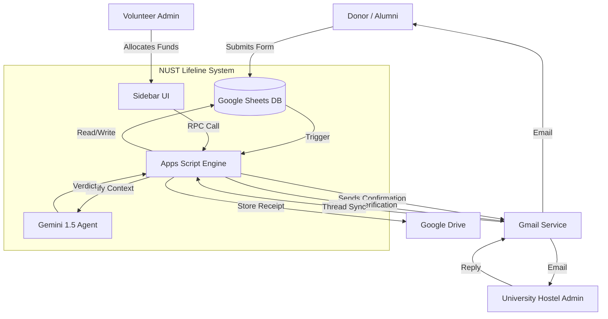
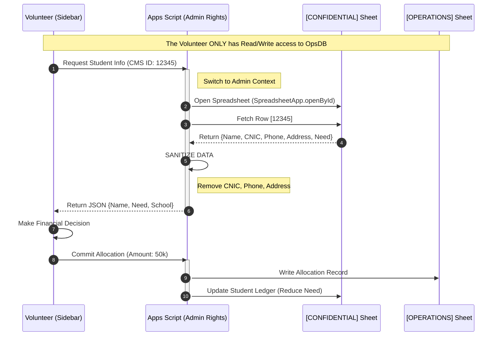
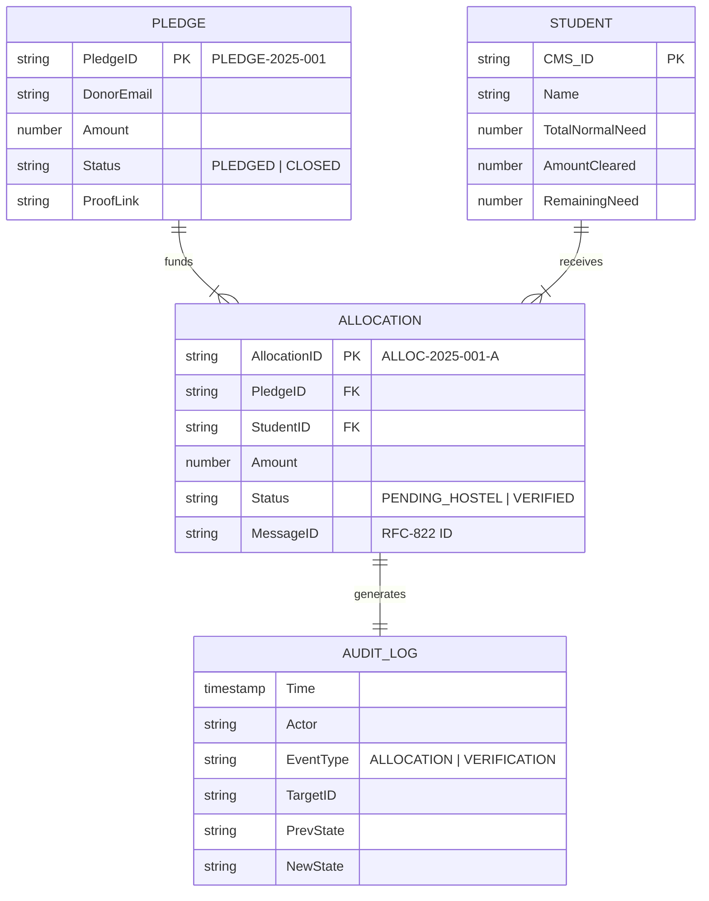

# 🏗️ System Architecture & Security Model

> **Scope:** High-Level Design, Data Flow, and Security Patterns.

This document details the architectural choices made to ensure data security, privacy compliance, and system scalability within the Google Workspace ecosystem.

## 1. System Context Diagram (C4 Level 1)

The following diagram illustrates the high-level interactions between the System, its Users (Volunteers, Donors), and External Systems (University, Gmail).

---

## 2. Data Segregation: The "Sanitized Proxy" Pattern

Direct access to student databases presents a significant privacy risk. We implemented a **Sanitized Proxy Pattern** to mitigate this.

### Sequence Diagram: The Safe Access Path
This diagram visualizes how the Volunteer accesses Student Data *without* ever touching the Confidential Database directly.

---

## 3. Data Model (Entity Relationship Diagram)

The system uses a relational schema mapped to Spreadsheet Tabs.

---

## 4. Event-Driven Messaging Architecture

To decouple the allocation process from the verification process, the system uses an asynchronous, message-driven architecture dependent on persistent Email IDs.

1.  **Ingress:** A form submission creates a `Pledge` record.
2.  **Allocation Event:** A user action triggers the `Allocation Service`...
    *(See Sequence Diagram above for details)*
3.  **State Persistence:** The system captures the globally unique **RFC-822 Message-ID** of the outgoing email.
4.  **Asynchronous Verification (Watchdog):** A separate cron job (`Watchdog.js`) scans the inbox...

---

## 5. Technology Stack Rationale

*   **Runtime:** **Google Apps Script (V8)**. Selected for its managed identity/auth context.
*   **Data Layer:** **Google Sheets**. Selected for its ubiquity and zero-cost "admin UI".
*   **AI Layer:** **Google Gemini 1.5 Flash**. Selected for large context window.

---

## 6. Security Controls

*   **RBAC:** Implemented via Google Drive folder permissions.
*   **Concurrency:** Application-level locking (`LockService`).
*   **Auditability:** Immutable write-only logging.
