# 🏗️ System Architecture & Security Model

> **Scope:** High-Level Design, Data Flow, Security Patterns, and Infrastructure.

This document details the architectural choices made to ensure data security, privacy compliance, and system scalability within the Google Workspace ecosystem.

---

## Table of Contents

- [System Overview](#system-overview)
- [Architecture Diagrams](#architecture-diagrams)
- [Core Architectural Principles](#core-architectural-principles)
- [Data Flow Architecture](#data-flow-architecture)
- [Security Architecture](#security-architecture)
- [Technology Stack](#technology-stack)
- [Integration Points](#integration-points)
- [Scalability Considerations](#scalability-considerations)

---

## System Overview

The NUST Lifeline System is a **serverless financial workflow automation platform** built entirely on Google Workspace infrastructure. It provides enterprise-grade capabilities—RBAC, locking, audit trails—at zero marginal infrastructure cost.

### Key Characteristics

| Attribute | Description |
|-----------|-------------|
| **Runtime** | Google Apps Script (V8 Engine) |
| **Data Layer** | Google Sheets as relational database |
| **AI Layer** | Google Gemini 3 Flash (Multimodal) |
| **Communication** | Gmail API with RFC-822 threading |
| **Storage** | Google Drive for document/receipt storage |
| **UI** | HTML Sidebar in Sheets |

---

## Architecture Diagrams

### System Context Diagram (C4 Level 1)

This diagram illustrates the high-level interactions between the System, its Users, and External Systems.

```mermaid
graph TD
    %% Actors
    subgraph External Actors
        Donor[👤 Donor / Alumni]
        Vol[👥 Volunteer Admin]
        Hostel[🏢 University Hostel Admin]
    end
    
    %% Core System Boundary
    subgraph "NUST Lifeline System"
        Forms[📝 Google Forms]
        Sheets[(📊 Google Sheets DB)]
        Script[⚙️ Apps Script Engine]
        AI[🤖 Gemini 3 Agent]
        Sidebar[🖥️ Sidebar UI]
    end
    
    %% External Systems
    Gmail[📧 Gmail Service]
    Drive[📁 Google Drive]

    %% Donor Flow
    Donor -->|1. Submit Pledge| Forms
    Forms -->|Trigger| Script
    Script -->|Store Data| Sheets
    Script -->|Send Confirmation| Gmail
    Gmail -->|Email| Donor
    Donor -->|2. Send Receipt| Gmail
    
    %% Volunteer Flow
    Vol -->|3. Allocate Funds| Sidebar
    Sidebar -->|RPC Call| Script
    Script -->|Read/Write| Sheets
    Script -->|Store Receipt| Drive
    Script -->|Verify Context| AI
    AI -->|Verdict| Script
    
    %% Hostel Flow
    Script -->|4. Request Verification| Gmail
    Gmail -->|Email| Hostel
    Hostel -->|5. Reply| Gmail
    
    %% Watchdog Flow
    Gmail -->|Thread Sync| Script
    Script -->|6. Close Loop| Sheets
    Script -->|7. Notify Donor| Gmail
```



---

### Container Diagram (C4 Level 2)

```mermaid
graph TB
    subgraph "Google Workspace"
        subgraph "Apps Script Container"
            DW[DonorWorkflow.js<br/>Pledge Processing]
            AW[AdminWorkflow.js<br/>Allocation & Receipts]
            WD[Watchdog.js<br/>Verification Monitor]
            SS[SidebarService.js<br/>UI Controller]
            LLM[LLM_Service.js<br/>AI Integration]
            Core[CoreLogic.js<br/>Business Rules]
            Util[Utilities.js<br/>Infrastructure]
            Audit[AuditService.js<br/>Event Logging]
        end
        
        subgraph "Data Stores"
            OpsSS[(OPERATIONS<br/>Spreadsheet)]
            ConfSS[(CONFIDENTIAL<br/>Spreadsheet)]
            DriveF[📁 Receipts<br/>Folder]
        end
        
        subgraph "External Services"
            GmailS[📧 Gmail API]
            GeminiS[🤖 Gemini API]
        end
    end
    
    DW --> Core
    AW --> Core
    WD --> Core
    SS --> AW
    
    AW --> LLM
    WD --> LLM
    
    LLM --> GeminiS
    
    Core --> OpsSS
    Core --> ConfSS
    AW --> DriveF
    
    DW --> GmailS
    AW --> GmailS
    WD --> GmailS
    
    Core --> Audit
    AW --> Audit
    WD --> Audit
```



---

### Data Segregation: The "Sanitized Proxy" Pattern

Direct access to student databases presents a significant privacy risk. We implemented a **Sanitized Proxy Pattern** to mitigate this.


---

### Allocation Transaction Sequence


---

### Watchdog Verification Flow


---

## Core Architectural Principles

### 1. Cost-Effective Resource Management ("Serverless ERP")

Instead of deploying capital-intensive enterprise software, we utilize the scalable, serverless infrastructure of **Google Apps Script**. This provides enterprise-grade capabilities with zero marginal infrastructure cost.

| Traditional ERP | Our Approach |
|----------------|--------------|
| $50k+ licensing | $0 (Workspace consumer tier) |
| Dedicated servers | Serverless execution |
| Custom auth | Google Identity |
| Separate DB | Sheets as relational store |

### 2. Privacy by Design: The "Two-Workbook" Model

Student data (names, school, degree, and financial need) is kept separate from operations data. We implemented strict **Air-Gap Architecture**:

| Workbook | Access | Contents |
|----------|--------|----------|
| **CONFIDENTIAL** | Core Admin Only | Student names, gender, school, degree, financial need |
| **OPERATIONS** | Volunteers | CMS IDs, aggregated financial needs, pledge data, allocation logs |

**The Bridge:** A server-side proxy service (`studentServices.js`) that returns only operational fields (CMS ID, need, school) to volunteers, keeping student names and full records restricted.

### 3. Transactional Integrity (Optimistic Concurrency)

To address the "Double-Spend" race condition inherent in collaborative spreadsheets, we implemented **Application-Level Locking**.

```javascript
const lock = LockService.getScriptLock();
try {
   lock.waitLock(30000);  // 1. ACQUIRE LOCK (Timeout: 30s)
   
   // 2. RE-READ STATE (Critical Freshness Check)
   const freshBalance = getRealTimePledgeBalance(pledgeId);
   
   // 3. VALIDATE
   if (amount > freshBalance) throw new Error("Insufficient Funds");
   
   // 4. COMMIT
   AllocLog.appendRow([...]);
   
} finally {
   lock.releaseLock();  // 5. RELEASE LOCK (Guaranteed)
}
```

### 4. Agentic Workflow (The AI Watchdog)

We deployed **Google Gemini 3** not just as a text generator, but as a logical reasoning engine:

- **Semantic Verification:** Analyzes unstructured email replies to determine if funds are "Verified," "Queried," or "Ambiguous"
- **Multimodal Analysis:** "Sees" receipt images to extract transfer dates and amounts
- **Reconciliation:** Cross-references email content against pending allocations to close specific line items

### 5. Human-in-the-Loop Governance

While automation handles data ingress and routing, key financial decisions remain strictly human-gated. The architecture uses automation to *prepare* the decision context (via Sidebar UI) but requires explicit human approval to *commit* funds.

---

## Data Flow Architecture

### Event-Driven Messaging

The system uses an asynchronous, message-driven architecture dependent on persistent Email IDs.

```
┌──────────────┐     ┌──────────────┐     ┌──────────────┐
│   INGRESS    │     │  PROCESSING  │     │   EGRESS     │
├──────────────┤     ├──────────────┤     ├──────────────┤
│ Form Submit  │────▶│ Generate ID  │────▶│ Email Donor  │
│ Email Receipt│────▶│ AI Analyze   │────▶│ Update Sheet │
│ Hostel Reply │────▶│ AI Classify  │────▶│ Close Loop   │
└──────────────┘     └──────────────┘     └──────────────┘
         │                  │                    │
         ▼                  ▼                    ▼
    ┌─────────────────────────────────────────────────┐
    │              AUDIT TRAIL (Immutable)            │
    └─────────────────────────────────────────────────┘
```

### State Persistence

The system captures the globally unique **RFC-822 Message-ID** of every outgoing email, enabling:

1. **Deterministic Thread Matching:** Incoming replies are matched to specific transactions
2. **Forensic Auditability:** Every database record links to an immutable email artifact
3. **Subject Line Resilience:** Threading works even if subjects are modified

---

## Security Architecture

### Defense in Depth

```
┌─────────────────────────────────────────────────────────────┐
│                    GOOGLE WORKSPACE                          │
│  ┌────────────────────────────────────────────────────────┐ │
│  │                 DRIVE PERMISSIONS                       │ │
│  │  ┌──────────────────────────────────────────────────┐  │ │
│  │  │            APPS SCRIPT CONTEXT                    │  │ │
│  │  │  ┌────────────────────────────────────────────┐  │  │ │
│  │  │  │         APPLICATION LOCKING                 │  │  │ │
│  │  │  │  ┌──────────────────────────────────────┐  │  │  │ │
│  │  │  │  │     DATA VALIDATION LAYER            │  │  │  │ │
│  │  │  │  │  ┌────────────────────────────────┐  │  │  │  │ │
│  │  │  │  │  │      AUDIT LOGGING              │  │  │  │  │ │
│  │  │  │  │  └────────────────────────────────┘  │  │  │  │ │
│  │  │  │  └──────────────────────────────────────┘  │  │  │ │
│  │  │  └────────────────────────────────────────────┘  │  │ │
│  │  └──────────────────────────────────────────────────┘  │ │
│  └────────────────────────────────────────────────────────┘ │
└─────────────────────────────────────────────────────────────┘
```

### Security Controls Matrix

| Layer | Control | Implementation | Threat Mitigated |
|-------|---------|----------------|------------------|
| **Data Segregation** | Physical Separation | Two spreadsheets: CONFIDENTIAL (student identities) and OPERATIONS (transactional) |
| **Access Control** | RBAC | Google Drive folder/file permissions |
| **Data Proxy** | Sanitized Access | `studentServices.js` returns only operational data (CMS ID, need, school) |
| **Concurrency** | Locking | `LockService.getScriptLock()` with 30s timeout |
| **Audit Trail** | Immutable Log | Append-only `Audit Trail` sheet with actor/timestamp/metadata |
| **Confidentiality** | Hashing | MD5 + Salt for reporting | Data linkage |

### Credential Management

| Credential | Storage | Rotation |
|------------|---------|----------|
| Gemini API Key | Script Properties | Manual (Google AI Studio) |
| OAuth Tokens | Managed by Google | Automatic |
| Reporting Salt | Script Properties | Never (breaks linkage) |

---

## Technology Stack

### Runtime Environment

| Component | Technology | Rationale |
|-----------|------------|-----------|
| **Language** | JavaScript (ES6+) | Native to Apps Script V8 |
| **Runtime** | Google Apps Script | Managed identity/auth context, serverless |
| **Quotas** | Consumer Tier | 90 min/day runtime, 100 emails/day |

### Data Layer

| Component | Technology | Rationale |
|-----------|------------|-----------|
| **Primary DB** | Google Sheets | Ubiquitous, free, admin UI built-in |
| **Schema** | Relational (normalized) | Integrity, no redundancy |
| **Sync** | Lookup tables | Performance optimization |

### AI Layer

| Component | Technology | Rationale |
|-----------|------------|-----------|
| **Model** | Gemini 3 Flash | Large context window, multimodal |
| **Interface** | REST API | Simple, reliable |
| **Output** | Structured JSON | Deterministic parsing |

### Communication Layer

| Component | Technology | Rationale |
|-----------|------------|-----------|
| **Email** | Gmail API | Native threading, rich HTML |
| **Threading** | RFC-822 IDs | Globally unique, immutable |
| **Templates** | Google Docs | Non-technical editing |

---

## Integration Points

### External Systems

```
┌─────────────────────────────────────────────────────────────┐
│                    NUST LIFELINE SYSTEM                      │
├─────────────────────────────────────────────────────────────┤
│  ┌─────────────┐  ┌─────────────┐  ┌─────────────┐          │
│  │   GMAIL     │  │   DRIVE     │  │   GEMINI    │          │
│  │   API       │  │   API       │  │   API       │          │
│  └──────┬──────┘  └──────┬──────┘  └──────┬──────┘          │
│         │                │                │                  │
└─────────┼────────────────┼────────────────┼──────────────────┘
          │                │                │
          ▼                ▼                ▼
    ┌───────────┐    ┌───────────┐    ┌───────────┐
    │ DONOR     │    │ RECEIPT   │    │ AI        │
    │ INBOX     │    │ STORAGE   │    │ REASONING │
    │ HOSTEL    │    │           │    │           │
    └───────────┘    └───────────┘    └───────────┘
```

### API Endpoints (Internal RPC)

The Sidebar UI communicates with the backend via `google.script.run`:

| Function | Purpose |
|----------|---------|
| `getSidebarData()` | Fetch pledge details for active row |
| `getAvailablePledgesForSidebar()` | List all allocable pledges |
| `processSidebarAllocation()` | Single allocation |
| `processBatchAllocation()` | Multi-pledge allocation |
| `getStudentDetails()` | Fetch student need |

---

## Scalability Considerations

### Current Capacity

| Resource | Limit (Consumer) | Typical Usage | Headroom |
|----------|------------------|---------------|----------|
| Email Recipients | 100/day | 10-20 | 5-10x |
| Script Runtime | 90 min/day | 40-60 min | 1.5x |
| Gmail Read Ops | 20,000/day | <500 | 40x |
| URL Fetch (AI) | 20,000/day | <100 | 200x |

### Scaling Path

1. **Upgrade to Google Workspace** → 1,500 emails/day
2. **Batch Processing** → Reduce trigger frequency
3. **Caching** → Script Properties for repeated lookups
4. **Sharding** → Split data by year/semester

### Performance Optimizations

| Optimization | Implementation |
|--------------|----------------|
| Batch Reads | `getDataRange().getValues()` |
| Lazy Loading | Only fetch full row when needed |
| Lookup Tables | Pre-computed summaries |
| Lock Timeout | 30s max wait to fail fast |
