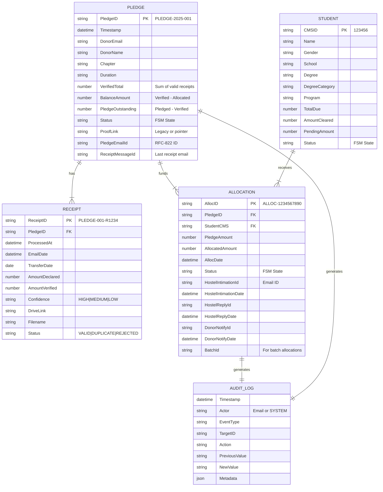
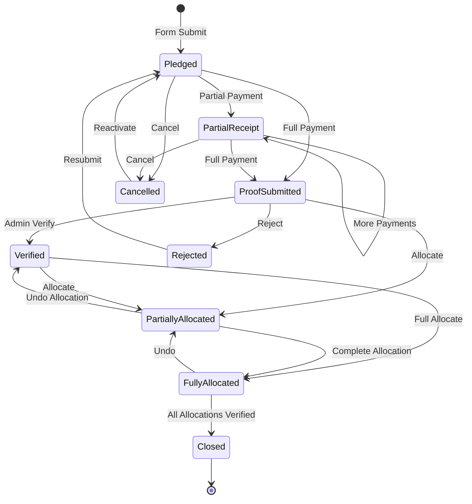
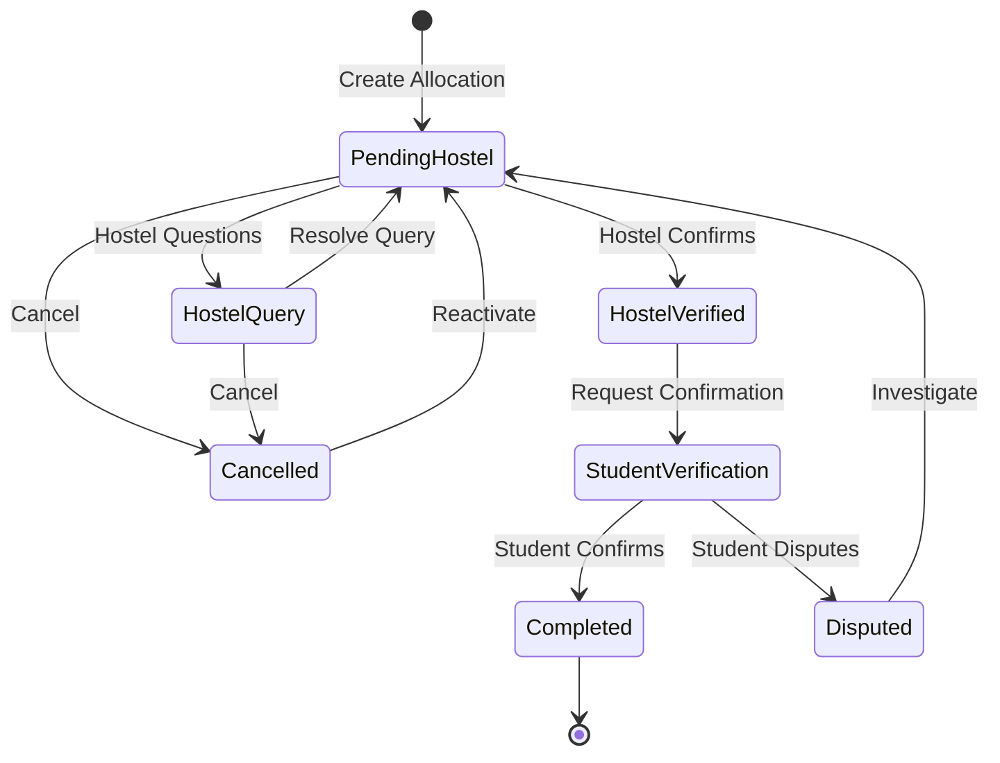
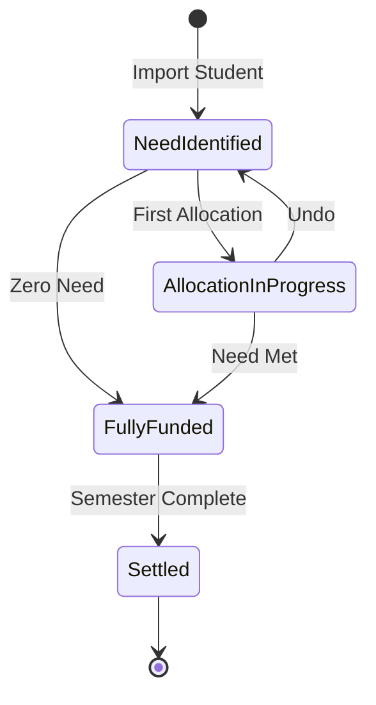

# 🔄 Data Model Reference

> **Scope:** Complete schema documentation, entity relationships, and status definitions for the NUST Lifeline System.

This document provides a comprehensive reference for all data structures, sheet schemas, and the Finite State Machine (FSM) that governs entity lifecycles.

---

## Table of Contents

- [Entity Relationship Diagram](#entity-relationship-diagram)
- [Sheet Schemas](#sheet-schemas)
  - [Donations (RAW Form Responses)](#donations-raw-form-responses)
  - [Receipt Log](#receipt-log)
  - [Allocation Log](#allocation-log)
  - [Student Database](#student-database)
  - [Audit Trail](#audit-trail)
  - [Lookup Tables](#lookup-tables)
- [Status Finite State Machine](#status-finite-state-machine)
- [Message ID Formats](#message-id-formats)
- [Configuration Schema](#configuration-schema)

---

## Entity Relationship Diagram



---

## Sheet Schemas

### Donations (RAW Form Responses)

**Sheet Name:** `(RAW) Form Responses`

This is the primary source of truth for all donation pledges.

| Column | Index | Field Name | Type | Description |
|--------|-------|------------|------|-------------|
| A | 1 | `timestamp` | DateTime | Form submission timestamp |
| B | 2 | `donorEmail` | String | Donor's email address |
| C | 3 | `donorName` | String | Donor's full name |
| D | 4 | `affiliation` | String | Donor's affiliation (Alumni, Faculty, etc.) |
| E | 5 | `mobile` | String | Contact number |
| F | 6 | `cityCountry` | String | Chapter/Location |
| G | 7 | `isZakat` | Boolean | Whether this is a Zakat donation |
| H | 8 | `studentPref` | String | Preferred student (if any) |
| I | 9 | `programPref` | String | Preferred program |
| J | 10 | `degreePref` | String | Preferred degree level |
| K | 11 | `duration` | String | Support duration (One Month, One Year, etc.) |
| L | 12 | `reqReceipt` | Boolean | Whether donor requests a receipt |
| M | 13 | `pledgeId` | String | Unique ID: `PLEDGE-YYYY-RRR` |
| N | 14 | `status` | String | Current FSM status |
| O | 15 | `proofLink` | String | Legacy proof link or pointer to Receipt Log |
| P | 16 | `dateProofReceived` | DateTime | When proof was last received |
| Q | 17 | `notes` | String | Admin notes |
| R | 18 | `cmsIdAssigned` | String | Last assigned student CMS ID |
| S | 19 | `amountAllocated` | Number | Last allocated amount |
| T | 20 | `actualTransferDate` | String | Extracted transfer date(s) |
| U | 21 | `receiptMessageId` | String | Last receipt email Message ID |
| V | 22 | `pledgeEmailId` | String | Initial confirmation email ID |
| W | 23 | `verifiedTotalAmount` | Number | **Sum of all verified receipts** |
| X | 24 | `balanceAmount` | Number | **Available funds (Verified - Allocated)** |
| Y | 25 | `pledgeOutstanding` | Number | **Gap (Pledged - Verified)** |

#### Calculated Fields Logic

```javascript
// Column W: verifiedTotalAmount
verifiedTotalAmount = SUM(ReceiptLog.AmountVerified WHERE Status='VALID' AND PledgeId=this.PledgeId)

// Column X: balanceAmount (Real-time available cash)
balanceAmount = verifiedTotalAmount - SUM(AllocationLog.Amount WHERE PledgeId=this.PledgeId)

// Column Y: pledgeOutstanding (Gap between promise and payment)
pledgeOutstanding = getPledgeAmountFromDuration(duration) - verifiedTotalAmount
```

---

### Receipt Log

**Sheet Name:** `Receipt Log`

Multi-receipt support for tracking all payment proofs.

| Column | Index | Field Name | Type | Description |
|--------|-------|------------|------|-------------|
| A | 1 | `receiptId` | String | Unique ID: `PLEDGE-001-R1234` |
| B | 2 | `pledgeId` | String | FK to Donations |
| C | 3 | `timestamp` | DateTime | When we processed it |
| D | 4 | `emailDate` | DateTime | When email was received |
| E | 5 | `transferDate` | Date/String | Extracted from receipt image |
| F | 6 | `amountDeclared` | Number | What donor claimed to send |
| G | 7 | `amountVerified` | Number | What AI verified from image |
| H | 8 | `confidence` | String | `HIGH`, `MEDIUM`, or `LOW` |
| I | 9 | `driveLink` | String | URL to file in Drive |
| J | 10 | `filename` | String | Original filename |
| K | 11 | `status` | String | `VALID`, `DUPLICATE`, `REJECTED`, `REQUIRES_REVIEW` |

---

### Allocation Log

**Sheet Name:** `Allocation Log`

Tracks all fund allocations with full lifecycle metadata.

| Column | Index | Field Name | Type | Description |
|--------|-------|------------|------|-------------|
| A | 1 | `allocId` | String | Unique ID: `ALLOC-{timestamp}` |
| B | 2 | `cmsId` | String | FK to Student Database |
| C | 3 | `pledgeId` | String | FK to Donations |
| D | 4 | `pledgeAmount` | Number | Total pledge amount (for reference) |
| E | 5 | `amount` | Number | **Allocated amount** |
| F | 6 | `date` | DateTime | Allocation timestamp |
| G | 7 | `status` | String | Current FSM status |
| H | 8 | `hostelIntimationId` | String | Outgoing email ID to hostel |
| I | 9 | `hostelIntimationDate` | DateTime | When hostel was notified |
| J | 10 | `donorAllocId` | String | Intermediate donor notification ID |
| K | 11 | `donorAllocDate` | DateTime | When donor was notified of allocation |
| L | 12 | `hostelReplyId` | String | Incoming reply ID from hostel |
| M | 13 | `hostelReplyDate` | DateTime | When hostel replied |
| N | 14 | `donorNotifyId` | String | Final donor notification ID |
| O | 15 | `donorNotifyDate` | DateTime | When loop was closed |
| P | 16 | `studentConfirmId` | String | (Future) Student confirmation ID |
| Q | 17 | `studentConfirmDate` | DateTime | (Future) When student confirmed |
| R | 18 | `batchId` | String | Shared ID for batch allocations |

---

### Student Database

**Sheet Name:** `Student Database` (in CONFIDENTIAL workbook)

Contains student information for fund allocation. Access restricted to core administrators.

| Column | Index | Field Name | Type | Description |
|--------|-------|------------|------|-------------|
| A | 1 | `cmsId` | String | Primary Key - Student ID |
| B | 2 | `name` | String | Full name |
| C | 3 | `gender` | String | Gender |
| D | 4 | `school` | String | NUST School (SEECS, SMME, etc.) |
| E | 5 | `degree` | String | Degree program |
| F | 6 | `totalDue` | Number | Total hostel dues |
| G | 7 | `amountCleared` | Number | **Computed: Sum of allocations** |
| H | 8 | `pendingAmount` | Number | **Computed: TotalDue - Cleared** |
| I | 9 | `status` | String | Current FSM status |
| J | 10 | `degreeCategory` | String | UG/PG/PhD |
| K | 11 | `program` | String | Specific program name |

---

### Audit Trail

**Sheet Name:** `Audit Trail`

Immutable log of all business events.

| Column | Index | Field Name | Type | Description |
|--------|-------|------------|------|-------------|
| A | 1 | `timestamp` | DateTime | Event timestamp |
| B | 2 | `actor` | String | User email or `SYSTEM` |
| C | 3 | `eventType` | String | Event category |
| D | 4 | `targetId` | String | Entity ID (Pledge, Alloc, etc.) |
| E | 5 | `action` | String | Human-readable description |
| F | 6 | `previousValue` | String | State before change |
| G | 7 | `newValue` | String | State after change |
| H | 8 | `metadata` | JSON | Additional context |

#### Event Types

| Event Type | Description |
|------------|-------------|
| `NEW_PLEDGE` | New pledge form submission |
| `RECEIPT_PROCESSED` | Receipt analyzed and logged |
| `RECEIPT_PROCESSED_V2` | Receipt processed with V2 multi-receipt support |
| `ALLOCATION` | Funds allocated to student |
| `HOSTEL_VERIFICATION` | Hostel confirmed receipt |
| `HOSTEL_QUERY` | Hostel raised a question |
| `STATUS_CHANGE` | Manual or automatic status update |
| `ALERT` | Watchdog flagged for manual review |

---

### Lookup Tables

These are derived/mirror tables for operational efficiency.

#### Student Lookup

**Sheet Name:** `Student Lookup` (in OPERATIONS workbook)

Sanitized mirror of students with pending needs.

| Column | Index | Field Name |
|--------|-------|------------|
| A | 1 | CMS ID |
| B | 2 | Total Due |
| C | 3 | Amount Cleared |
| D | 4 | Pending Amount |

#### Pledge Lookup

**Sheet Name:** `Pledge Lookup` (in OPERATIONS workbook)

Real-time pledge balance summary.

| Column | Index | Field Name |
|--------|-------|------------|
| A | 1 | Pledge ID |
| B | 2 | Total Pledged |
| C | 3 | Amount Used |
| D | 4 | Cash Balance (Available) |
| E | 5 | Pledge Outstanding |
| F | 6 | Verified Total |

---

## Status Finite State Machine

The system enforces strict state transitions for data integrity.

### Pledge Status FSM



#### Status Values

| Status | Code | Description |
|--------|------|-------------|
| Pledged | `1 - Pledged` | Initial state after form submission |
| Partial Receipt | `1a - Partial Receipt` | Some but not all funds received |
| Proof Submitted | `2 - Proof Submitted` | Full payment proof received |
| Verified | `3 - Verified` | Admin verified the proof |
| Partially Allocated | `4 - Partially Allocated` | Some funds allocated |
| Fully Allocated | `5 - Fully Allocated` | All funds allocated |
| Closed | `6 - Closed` | All allocations verified by hostel |
| Cancelled | `9 - Cancelled` | Pledge cancelled |
| Rejected | `9 - Rejected` | Proof rejected |

---

### Allocation Status FSM



#### Status Values

| Status | Code | Description |
|--------|------|-------------|
| Pending Hostel | `1 - Pending Hostel` | Awaiting hostel verification |
| Hostel Query | `2 - Hostel Query` | Hostel raised a question |
| Hostel Verified | `3 - Hostel Verified` | Hostel confirmed receipt |
| Student Verification | `4 - Student Verification` | (Future) Awaiting student |
| Completed | `5 - Completed` | Fully verified and closed |
| Disputed | `6 - Disputed` | Student disputes allocation |
| Cancelled | `9 - Cancelled` | Allocation cancelled |

---

### Student Status FSM



#### Status Values

| Status | Code | Description |
|--------|------|-------------|
| Need Identified | `1 - Need Identified` | Student has pending hostel dues |
| Allocation In Progress | `2 - Allocation In Progress` | Some funds allocated |
| Fully Funded | `3 - Fully Funded` | All dues covered |
| Settled | `4 - Settled` | Semester/Year complete |

---

## Message ID Formats

The system uses RFC-822 Message-IDs for email threading and audit trails.

### Stored Formats

| Format | Example | Description |
|--------|---------|-------------|
| RFC-822 | `<abc123@mail.gmail.com>` | Standard email Message-ID |
| With Prefix | `rfc822msgid:<abc123@mail.gmail.com>` | For Gmail search |
| API ID | `id:18abc123def456` | Gmail API message ID |

### Usage

```javascript
// Store RFC ID for robust threading
const msgId = getRfcIdFromMessage(sentMessage);
sheet.getRange(row, col).setValue(formatIdForSheet(msgId));
// Stores: "rfc822msgid:<abc123@mail.gmail.com>"

// Search for thread
const threads = GmailApp.search(`rfc822msgid:<abc123@mail.gmail.com>`, 0, 1);
```

---

## Configuration Schema

### CONFIG Object

```javascript
const CONFIG = {
  // Spreadsheet IDs
  ssId_operations: 'string',      // Operations workbook ID
  ssId_confidential: 'string',    // Confidential workbook ID
  
  // Folder IDs
  folderId_receipts: 'string',    // Receipt storage folder
  folderId_emailTemplates: 'string',
  
  // Pledge Amounts (PKR)
  pledgeAmounts: {
    oneMonth: 25000,
    oneSemester: 150000,
    oneYear: 300000,
    fourYears: 1200000
  },
  
  // AI Configuration
  GEMINI_MODEL: 'gemini-3-flash-preview'
};
```

### SHEETS Object

```javascript
const SHEETS = {
  donations: {
    name: '(RAW) Form Responses',
    cols: { /* Column indices */ }
  },
  receipts: {
    name: 'Receipt Log',
    cols: { /* Column indices */ }
  },
  allocations: {
    name: 'Allocation Log',
    cols: { /* Column indices */ }
  },
  students: {
    name: 'Student Database',
    cols: { /* Column indices */ }
  },
  audit: {
    name: 'Audit Trail',
    cols: { /* Column indices */ }
  }
};
```

### EMAILS Object

```javascript
const EMAILS = {
  ddHostels: 'ddhostels@university.edu',  // Hostel administration
  uao: '',                                 // University accounts
  processOwner: 'nustlifeline@gmail.com', // System email
  alwaysCC: ['nustlifeline@gmail.com']    // Always CC these addresses
};
```

### MAPPINGS Object

```javascript
const MAPPINGS = {
  chapterLeads: {
    'UK': ['uk.lead1@email.com', 'uk.lead2@email.com'],
    'USA': ['usa.lead@email.com'],
    'Other': ['default@email.com']  // Fallback
  }
};
```

### TEMPLATES Object

```javascript
const TEMPLATES = {
  pledgeConfirmation: 'GOOGLE_DOC_ID',        // Initial confirmation
  hostelVerification: 'GOOGLE_DOC_ID',        // Single allocation email
  donorAllocationNotification: 'GOOGLE_DOC_ID', // Intermediate donor notify
  hostelMailto: 'GOOGLE_DOC_ID',              // Mailto link body template
  finalDonorNotification: 'GOOGLE_DOC_ID',    // Verification complete
  batchIntimationToHostel: 'GOOGLE_DOC_ID',   // Batch allocation email
  batchDonorMailtoBody: 'GOOGLE_DOC_ID'       // Batch mailto body
};
```

---

## Data Integrity Rules

### Constraint 1: Allocation Amount ≤ Available Balance

```javascript
const available = getRealTimePledgeBalance(pledgeId, rowData);
if (amount > available) {
  throw new Error('Insufficient funds');
}
```

### Constraint 2: Allocation Amount ≤ Student Need

```javascript
const need = getRealTimeStudentNeed(cmsId);
if (amount > need) {
  throw new Error('Amount exceeds student need');
}
```

### Constraint 3: Verified Total ≥ Allocated Total

The system will not allow allocations exceeding verified receipts.

### Constraint 4: Status Transitions Must Be Valid

```javascript
StateManager.validateTransition('PLEDGE', currentStatus, targetStatus);
// Throws error if invalid transition
```

---

## Anonymization for Reporting

The reporting warehouse uses one-way hashing for student data.

```javascript
// Hash function
const hashStr = Utilities.computeDigest(
  Utilities.DigestAlgorithm.MD5, 
  cmsId + salt
).map(b => (b < 0 ? b + 256 : b).toString(16).padStart(2, '0'))
 .join('')
 .substring(0, 12);

// Result: "a1b2c3d4e5f6" (irreversible)
```

The salt is stored in Script Properties and never exposed.
